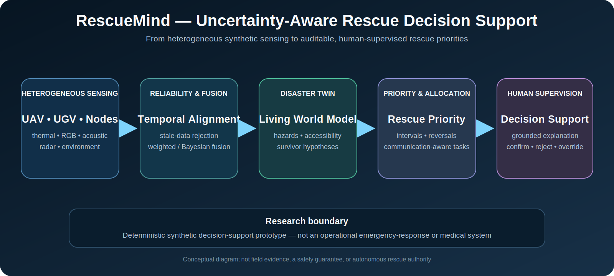

<div align="center">

# RescueMind Prototype

## Uncertainty-Aware Multi-Agent Perception and Human-Supervised Rescue Decision Support

A reproducible synthetic research platform for studying how heterogeneous sensing, uncertainty, communication degradation, and dynamic hazards affect rescue prioritization and task allocation.

[](.) [](.)

**English** · [Ελληνικά](README_GR.md)

</div>

<p align="center"></p>

<p align="center"><em>Conceptual research overview. It is not field evidence, medical advice, a safety guarantee, or autonomous rescue authority.</em></p>

## Abstract

RescueMind-Prototype investigates decision support for post-disaster response when observations are incomplete, delayed, conflicting, or degraded. The platform simulates UAV, UGV, and static sensing agents that produce thermal, RGB, acoustic, radar, and environmental observations. These observations are time-aligned, assigned reliability states, filtered for stale or duplicate evidence, and fused into survivor hypotheses and a dynamic Living Disaster Twin.

The research contribution is not an autonomous triage system. It is an auditable pipeline that exposes the evidence, uncertainty, provenance, priority components, communication constraints, allocation decision, and explanation presented to a human operator. All current quantitative outputs are generated in deterministic synthetic scenarios.

## Research question

> How can heterogeneous and degraded observations from multiple agents be fused into transparent, uncertainty-aware, and human-supervised rescue-priority decisions?

## Architecture

```text
synthetic disaster world
  → UAV / UGV / static nodes
  → multimodal observations
  → reliability and temporal alignment
  → fixed / weighted / Bayesian fusion
  → conflict and provenance checks
  → survivor hypotheses and disaster twin
  → rescue-priority intervals
  → communication-aware task allocation
  → grounded explanation and human review
```

## Research contributions

- heterogeneous synthetic sensing and degradation;
- stale-data, duplicate, provenance, and conflict handling;
- fixed, reliability-weighted, and Bayesian fusion baselines;
- dynamic hazard and accessibility representation;
- survivor-hypothesis lifecycle scaffolding;
- decomposable Rescue Priority Index with intervals;
- communication-aware allocation under packet loss and delay;
- grounded explanations and counterfactual support;
- calibration and classification metrics for synthetic evaluation.

## Verified scope

| Component | Status |
|---|---|
| Deterministic 2-D disaster simulation | Research Prototype |
| UAV, UGV, and static sensor agents | Implemented |
| Thermal, RGB, acoustic, radar, environmental observations | Synthetic Validation |
| Reliability states and environment-dependent degradation | Implemented |
| Temporal buffering and stale-data rejection | Implemented |
| Fixed, reliability-weighted, Bayesian fusion | Implemented |
| Dynamic Living Disaster Twin | Research Prototype |
| Rescue Priority Index with intervals | Implemented |
| Communication-aware allocation | Implemented |
| Grounded explanation and counterfactual | Research Prototype |
| ROS 2, external datasets, physical robots | Validation Pending |

## Reproduce

```bash
python -m venv .venv
source .venv/bin/activate
pip install -e '.[dev]'
pytest
python scripts/run_all.py --mode smoke
python scripts/run_benchmark_suite.py --num-seeds 5
```

Run modes: `smoke`, `perception`, `fusion`, `digital-twin`, `coordination`, `priority`, `benchmark`, `full`.

## Evaluation

The framework reports Brier score, ECE, MCE, precision, recall, F1, priority reversal, communication degradation, allocation behavior, and generated artifact provenance. Results must always be labelled **Synthetic Validation** and associated with their seed, configuration, command, and commit.

## Limitations

- No field, medical, structural, ROS 2, hardware, or external-dataset validation is claimed.
- The disaster environment and sensing modalities are synthetic approximations.
- Rescue priorities are decision-support signals, not medical triage decisions.
- The digital twin and survivor hypotheses remain research models.
- The system must not be deployed in real emergencies.

## Responsible use

Human operators retain authority to confirm, reject, override, or request more evidence. RescueMind is research software and not an operational emergency-response command system.
